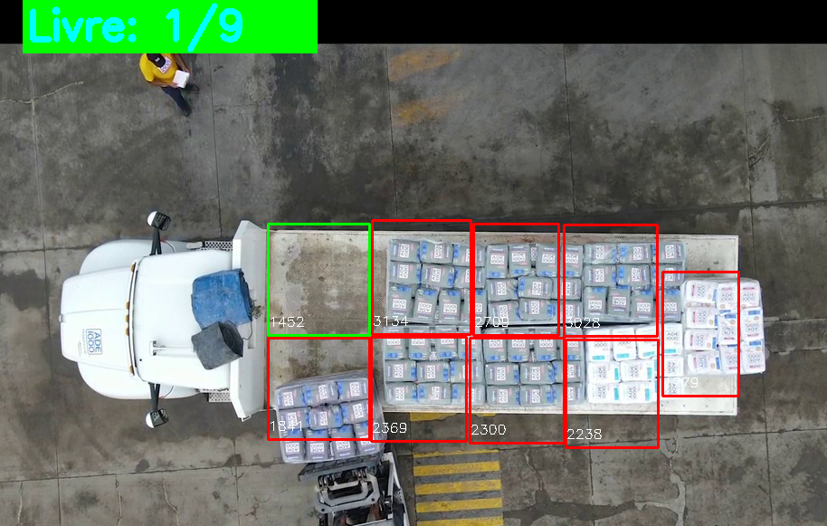

# Projeto de Visão Computacional

Projeto criado para disciplina Fundamentos de Inteligência Artificial

## Objetivo 

Monitorar vagas de carga em um caminhão


## Configuração do Ambiente Virtual
- Passos para criar e ativar um ambiente virtual:
- Criar o ambiente virtual:

```bash
virtualenv venv
```
- Ativar o ambiente virtual:

No Linux:
```bash
source venv/bin/activate
```

## Instalação de Dependências
Certifique-se de que seu ambiente virtual esteja ativado. Instale as dependências listadas no arquivo requirements.txt:

```bash
pip install -r requirements.txt
```
Conteúdo do arquivo requirements.txt:
```txt
numpy==2.1.3
opencv-python==4.10.0.84
```

### Execução

```bash
python main.py
```

### Resultado


